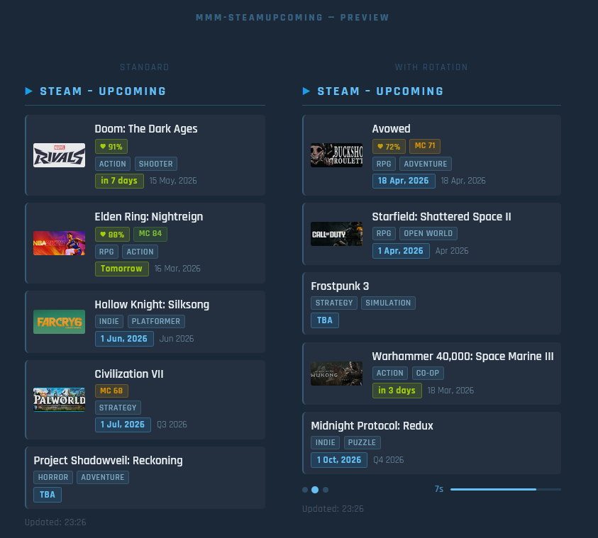

# MMM-SteamUpcoming

A MagicMirror² module that shows upcoming Steam games – games that have been announced but not yet released. Built as a companion to **MMM-SteamDeals**, it reuses the same genre filter, country/region filter, rotation, and visual design.
No API key required.
This module was vibe coded with Anthropic's Claude AI - Sonnet 4.6. Please feel free to adapt it / improve it / make suggestions.

---

## Screenshot



---

## Features

- **Coming Soon list** pulled directly from the Steam Store
- **Release date badge** – relative ("in 5 days", "Tomorrow") for near releases, formatted date for further ones
- **Genre filter** – same strings as MMM-SteamDeals (`Action`, `RPG`, `Indie`, …)
- **Country/region filter** – hides games not available in your region
- **`daysAhead` filter** – only show games releasing within N days
- **Rotation** with page dots and countdown bar
- **Score badges** – Steam user rating + Metacritic (shown when pre-release scores exist)
- **Bilingual** – `en` / `de`

---

## Installation

```bash
cd ~/MagicMirror/modules
git clone https://github.com/badubada/MMM-SteamUpcoming
# No npm install needed – no external dependencies
```

---

## Configuration

Add to `config/config.js`:

```js
{
  module:   "MMM-SteamUpcoming",
  position: "top_right",
  config: {
    title:    "Steam – Upcoming",
    maxGames: 5,
    language: "en",       // "en" | "de"
    country:  "DE",       // ISO country code or null
    daysAhead: 90,        // 0 = no limit
    genres:   [],         // e.g. ["Action", "RPG"]
    sortBy:   "release",  // "release" | "name"
  }
}
```

See `config.example.js` for the full reference with all options and supported country codes.

---

## Options

| Option | Default | Description |
|--------|---------|-------------|
| `title` | `"Steam – Upcoming"` | Header text |
| `maxGames` | `5` | Games per page |
| `showCovers` | `true` | Show capsule artwork |
| `showReleaseDate` | `true` | Show release date badge |
| `showScores` | `true` | Steam / Metacritic score badges |
| `language` | `"en"` | `"en"` or `"de"` |
| `country` | `null` | ISO 3166-1 alpha-2 code, e.g. `"DE"` |
| `daysAhead` | `90` | Only show games releasing within N days (`0` = all) |
| `genres` | `[]` | Genre filter list |
| `sortBy` | `"release"` | `"release"` (soonest first) or `"name"` |
| `rotationEnabled` | `false` | Auto-rotate pages |
| `rotationInterval` | `10000` | ms between page changes |
| `rotationShowPage` | `true` | Show page dots + countdown bar |
| `updateInterval` | `3600000` | Data refresh interval (ms) |
| `animationSpeed` | `1000` | DOM animation speed (ms) |

---

## API

Data comes from Steam's own store search API (no API key required):

```
https://store.steampowered.com/search/results/?filter=comingsoon&json=1&cc=DE&l=english&count=60
```

When a genre or country filter is active, one additional call per game is made to:

```
https://store.steampowered.com/api/appdetails?appids=<id>&filters=genres,price_overview&cc=DE
```

---

## Differences from MMM-SteamDeals

| | MMM-SteamDeals | MMM-SteamUpcoming |
|---|---|---|
| Data source | CheapShark API | Steam Store API |
| Focus | Discounted games | Unreleased games |
| Price display | Sale price + discount | — |
| Release date | — | Relative + formatted badge |
| `minDiscount` / `maxPrice` | ✓ | — |
| `daysAhead` | — | ✓ |
| Genre filter | ✓ | ✓ |
| Country filter | ✓ | ✓ |
| Rotation | ✓ | ✓ |

## Requirements

- MagicMirror² v2.x
- Node.js ≥ 18 (native `fetch` is used — no `npm install` needed)  
  For Node < 18: `npm install node-fetch@2` inside the module folder

---

## Disclaimer

MMM-SteamUpcoming is an independent, community-developed module for MagicMirror² and is not affiliated with, endorsed by, or in any way officially connected to Valve Corporation or the Steam platform. All trademarks, service marks, trade names, product names, and logos — including "Steam" — are the property of their respective owners.
Game data — including titles, release dates, cover images, genres, and ratings — is retrieved at runtime from the Steam Store API and remains the property of their respective publishers and developers. This module does not store, redistribute, or monetise any of that data; it is fetched solely for personal, non-commercial display purposes.
Use of the Steam Store API is subject to Valve's Steam Web API Terms of Use.

---

## License

MIT
